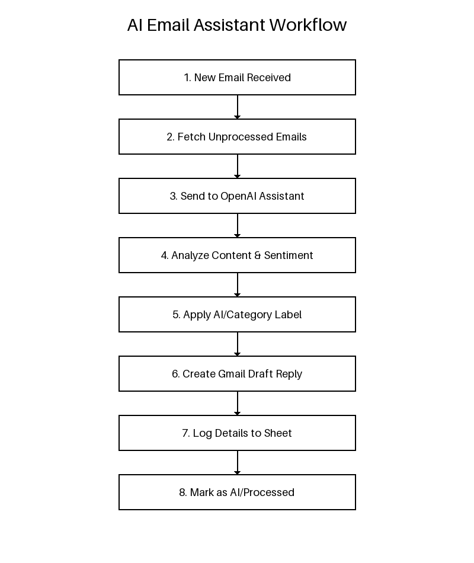
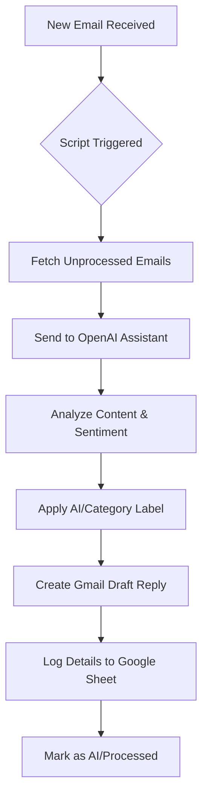

# 🤖 AI Email Assistant (Inbox Copilot)

An intelligent Gmail automation script that uses OpenAI's Assistant API (Agents) to analyze incoming emails, categorize them, determine sentiment/urgency, and automatically create draft replies.

## 📌 Overview
Managing a high volume of emails can be overwhelming. The **AI Email Assistant** acts as your first-line "copilot," processing your inbox every few minutes. It doesn't just label emails; it understands the content and prepares a relevant draft reply for you to review and send.

## ⚙️ How It Works
1.  **Search:** The script scans your Gmail inbox for new, unprocessed threads.
2.  **Analyze:** It sends the latest message content to an **OpenAI Assistant**.
3.  **Categorize & Label:** Based on the AI's analysis, it applies specific labels (e.g., `AI/Sales`, `AI/Support`) and marks the thread as `AI/Processed`.
4.  **Draft Reply:** The AI generates a contextual response, which the script saves as a **Gmail Draft**.
5.  **Log:** All actions, including metadata like sentiment and urgency, are logged to a **Google Sheet**.

## 🚀 Features
-   **Automated Categorization:** Automatically sorts emails into Sales, Support, Partners, etc.
-   **Sentiment & Urgency Detection:** Helps you prioritize which emails to answer first.
-   **Smart Drafts:** Saves time by pre-writing responses based on your specific instructions to the AI.
-   **Safe by Design:** The script *never* sends emails automatically; it only creates drafts for your approval.
-   **Cleaning & Sanitization:** Automatically removes AI-generated artifacts (like citations or internal notes) from the draft.

## 📊 Workflow Diagram

## 🛠️ Setup Instructions
1.  **OpenAI API Key:** Obtain an API key from [OpenAI](https://platform.openai.com/).
2.  **Create Assistant:** Create an Assistant in the OpenAI Dashboard and note the `Assistant ID` (starts with `asst_`).
3.  **Google Sheet:** Create a new Google Sheet.
4.  **Apps Script:** Open *Extensions > Apps Script* and paste the `code.gs` content.
5.  **Script Properties:** Go to *Project Settings* and add the following:
    -   `OPENAI_API_KEY`: Your secret key.
    -   `OPENAI_ASSISTANT_ID`: The ID of the assistant you created.
    -   `TARGET_LABEL` (Optional): If you only want to process emails with a specific label.
6.  **Trigger:** Set up a time-driven trigger (e.g., every 5-10 minutes) for the `runInboxCopilot` function.

## 🛠️ Technologies Used
-   Google Apps Script
-   OpenAI Assistants API (v2)
-   Gmail API
-   Google Sheets API
