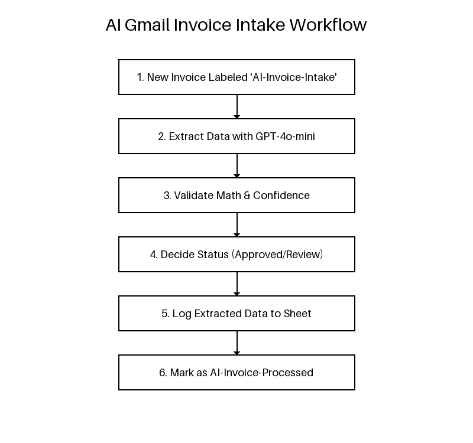
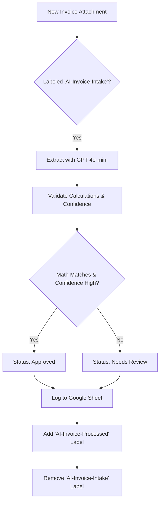

# 🧾 AI Gmail Invoice Intake

Automatically extract invoice data from Gmail attachments (PDF/DOCX) using OpenAI's **gpt-4o-mini** with structured output.

## 📌 Overview
Manually entering data from invoices into a spreadsheet is a repetitive and error-prone task. The **AI Gmail Invoice Intake** script automates this process by:
1.  **Scanning:** Looks for specific Gmail labels (e.g., `AI-Invoice-Intake`).
2.  **Extracting:** Uses OpenAI's latest models to accurately extract data like vendor name, date, subtotal, tax, and total.
3.  **Validating:** Performs mathematical checks (e.g., `subtotal + tax = total`) and flags discrepancies.
4.  **Logging:** Appends all extracted data and validation flags to a Google Sheet.
5.  **Status Reporting:** Categorizes invoices as `approved`, `needs_review`, or `ignored` based on confidence and validation.

## ⚙️ How It Works
1.  **Trigger:** The script runs periodically to find threads labeled `AI-Invoice-Intake`.
2.  **Processing:** It processes PDF or DOCX attachments from each message.
3.  **AI Extraction:** It sends the document to the OpenAI Responses API with a strict JSON schema.
4.  **Mathematical Check:** Validates the extraction by recalculating the total.
5.  **Review System:** If the AI is not confident or if math doesn't add up, the script adds a `AI-Invoice-Review` label for manual check.
6.  **Archiving:** Once processed, the original label is removed and replaced with `AI-Invoice-Processed`.

## 🚀 Features
-   **Structured Outputs:** Uses OpenAI's latest JSON schema features for extremely high reliability.
-   **Supports PDF & DOCX:** Extracts data from the most common business document formats.
-   **Automated Validation:** Flags mathematical errors or missing information.
-   **Multi-Status Workflow:** Automatically identifies documents that need human eyes.
-   **Audit Log:** Keeps a complete record of every extraction, including raw JSON and AI confidence scores.

## 📊 Workflow Diagram

## 🛠️ Setup Instructions
1.  **OpenAI API Key:** Obtain an API key from [OpenAI](https://platform.openai.com/).
2.  **Google Sheet:** Create a sheet and name a tab `intake_log`.
3.  **Apps Script:** Open *Extensions > Apps Script* and paste the `code.gs` content.
4.  **Script Properties:** Go to *Project Settings* and add:
    -   `OPENAI_API_KEY`: Your secret key.
    -   `OPENAI_MODEL`: (Optional) Defaults to `gpt-4o-mini`.
5.  **Gmail Labels:** Create the following labels in Gmail:
    -   `AI-Invoice-Intake`
    -   `AI-Invoice-Processed`
    -   `AI-Invoice-Review`
6.  **Trigger:** Set up a time-driven trigger for the `runIntakeOnce` function.

## 🛠️ Technologies Used
-   Google Apps Script
-   OpenAI Responses API (Structured Outputs)
-   Gmail API
-   Google Sheets API
